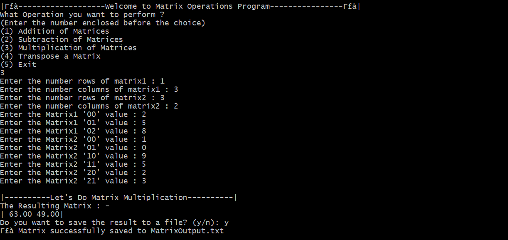

# 🧮 Matrix Operations in C

A terminal-based C program to perform various operations on matrices using float-type elements. Designed with clarity, functionality, and user interaction in mind — perfect for students and beginner programmers.

---

## ✅ Features

- ➕ Matrix Addition
- ➖ Matrix Subtraction
- ✖️ Matrix Multiplication
- 🔁 Matrix Transpose
- 💾 Optional file output (`MatrixOutput.txt`)

Each operation accepts dynamic dimensions and float values, with nicely formatted matrix outputs.

---

## 🚀 How to Compile & Run

### 🖥️ Requirements:
- GCC Compiler
- Terminal (Git Bash / CMD / Linux / Mac)

### 🔧 Compile:
```bash
gcc MatrixOperation.c -o MatrixOperation
```

### ▶️ Run:
```bash
./MatrixOperation
```

---

## 🧑‍💻 Usage Example

```
✅-------------------Welcome to Matrix Operations Program----------------✅
What Operation you want to perform?
(1) Addition of Matrices
(2) Subtraction of Matrices
(3) Multiplication of Matrices
(4) Transpose a Matrix
(5) Exit
Enter your choice: 1

Enter the number rows of matrix: 2
Enter the number columns of matrix: 2
Enter Matrix1[00] value: 1
Enter Matrix1[01] value: 2
...
Do you want to save the result to a file? (y/n): y
✅ Matrix successfully saved to MatrixOutput.txt
```

---

## 📁 Output File Format

If you choose to save the result:
```
Resulting Matrix:
| 3.00 4.00 |
| 5.00 6.00 |
```

File: `MatrixOutput.txt` (auto-created or overwritten)

---

## 📸 Screenshot (Optional)



> Add a terminal screenshot of your program output here if you like

---

## 👑 Created By

**Mayank Koli**  
Coded in pure C with Git Bash & VS Code  
Feel free to fork, star, or suggest improvements!

---

## 📜 License

This project is open source and free to use for learning and academic purposes.
